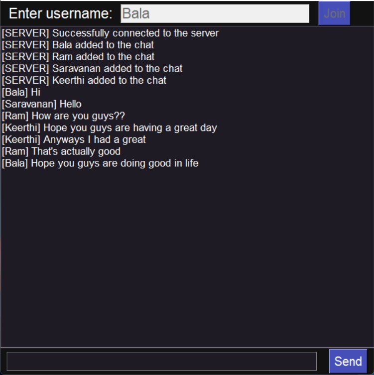

# Real-Time-Chatting-Application

## A real time chatting application, created using tkinter module, threading and socket programming

### How to Clone This Repository

Open terminal and type the following command

```
git clone https://github.com/Aakash-suresh/Real-Time-Chatting-Application
```
Or else you can directly download it from thiis page

## How to execute this program:

Start by executing the server side script by opening command prompt at project root directory and type

```
python server.py
```

Once the server is up and running, create a client by running client script, which is done by typing

```
python client.py
```

OR 

you can directly open if you have already installed Python environment 

## Used Environment 
    •PyCharm Community Edition 


## Output:
<div style="width: 60%; height: 60%">
  
  
  
</div>
